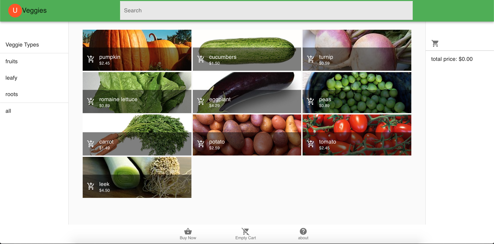

<!--
  Copyright DataStax, Inc.
  Licensed under the Apache License, Version 2.0 (the "License");
  you may not use this file except in compliance with the License.
  You may obtain a copy of the License at
  http://www.apache.org/licenses/LICENSE-2.0
  Unless required by applicable law or agreed to in writing, software
  distributed under the License is distributed on an "AS IS" BASIS,
  WITHOUT WARRANTIES OR CONDITIONS OF ANY KIND, either express or implied.
  See the License for the specific language governing permissions and
  limitations under the License.
-->
# U Veggies

Simple veggie shop to demonstrate building a frontend with Stargate. This is
a work in progress and may have many bugs or issues, but should demostrate properly
how to query Stargate with simple http calls using the very common fetch client
for remote calls.



## Where to look

The optimal place to look is in [StargateRepository.ts](src/models/StargateRepository.ts)
this is where the majority of remote calls to the Stargate service are located.

### Important Samples

#### Paging

```typescript
  setRows(resultAction: (p: Array<Product>) => void): void {
  ///setup a method for recursion so we can continue to page until
  // we've gotten the full result set
  const getPage = (
   continueId: string | undefined,
   products: Array<Product>
) => {
  //using the payload query string parameter because fetch does not
  //support GET methods with a body
  //since this is the initial page load by default we are doing the
  //"-match": "all" to retrieve all rows
  //3 rows at a time so we can demonstrate paging and how it works.
  let queryUrl =
    this.productsUrl +
      '?payload={ "-continue": true, "-limit": 3, "-match" : "all", "category": {}}';
  if (continueId) {
    //continue the query by the token provided by previous queries
    queryUrl = this.wrapUrl(
      `/query/continue/${continueId}`
    );
  }
  fetch(queryUrl, {
    method: "GET",
    headers: jsonHeaders
  })
    .then(x => x.json())
    .then(x => x as QueryResponse<Product>)
    .then(x => {
      x.data.forEach(x => products.push(x));
      //when there is a continueId present go ahead and page
      //otherwise just run the resultAction
      if (x.continue.continueId) {
        getPage(
          x.continue.continueId,
          products
      );
      } else {
        resultAction(products);
    }
    });
};
    //start paging
    getPage(undefined, new Array<Product>());
  }
}
```

#### Handling several mutations at once

```typescript

  const tomato = new Product(
      "tomato",
      "tomato.jpg",
      "wonderful on nearly everything",
      245
    );
    fruitCat.products.push(tomato);
    //post it all at once
    const categories = new Array<Category>();
    categories.push(leafyCat);
    categories.push(rootCat);
    categories.push(fruitCat);
    //What follows is  great example of how to create several things
    //in one operation and how easy this is to do.
    //NOTE: All relationsips in the object graph are linked by default.
    //this is managed by the server with a logged batch so careful
    //how many one sends at a time.
    const categoryPost = JSON.stringify(categories);
    let response = await fetch(this.categoriesUrl, {
      method: "POST",
      body: categoryPost,
      headers: jsonHeaders
    });
    let categoryJsonResponse = await response.json();
    let categoryResponse = (await categoryJsonResponse) as CategoryMutationResponse;
    if (
      categoryResponse !== undefined &&
      categoryResponse.data !== undefined
    ) {
      categoryResponse.data.forEach(
        (c: ParentMutation, i: number) => {
          categories[i].entityId = c.entityId;
          c.products.forEach(
            (m: Mutated, mi: number) => {
              categories[i].products[
                mi
              ].entityId = m.entityId;
            }
          );
        }
      );
    } else {
      console.log(
        "failed to retrieve entityId for category, error is '" +
          categoryResponse +
          "'"
      );
    }

```

## How to run

1. Apache Cassandra 3.11 running on port 9042 locally.
`docker run -d -p9042:9042 cassandra:3.11.6` should work.
2. make sure you have stargate running somewhere. `mvn package exec:exec` from the
base startgate directory will do the job.
3. `npm run start` from this directory.

Open [http://localhost:3000](http://localhost:3000) to view it in the browser.
